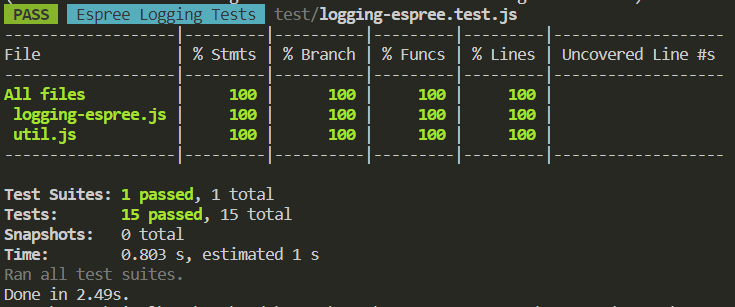

[](https://classroom.github.com/open-in-codespaces?assignment_repo_id=10279653)
# Práctica Espree logging
  - Autor: Gian Luis Bolivar Diana
  - Email: _gian.diana.28@ull.edu.es_

## Resumen de lo aprendido

A lo largo del desarrollo de la práctica, hemos obtenido los conocimientos necesarios para recorrer AST generados:
  - Somos capaces de ejecutar funciones cuando exploramos el nodo (_enter:_), o al finalizar la exploración de todos sus hijos (_leave:_).
  - Podemos obtener componentes de un nodo que represente una función, tales como:
    - El nombre (si no es anónima):
      ```js
      node.id?.name ?? '<anonymous function>';
      ```
    - Argumentos (obligatorios y opcionales):
      ```js
        if (p.type === 'Identifier') return `\${ ${p.name} }`;
        else if (p.type === 'RestElement') return `...\${ ${p.argument.name} }`;
        else if (p.type === 'AssignmentPattern') return `\${ ${p.left.name} } = ${p.right.value}`;
      ```
    - Linea de  en el código:
      ```js
      node.loc.start.line;
      ```
    - Cuerpo de la función:
      ```js
      node.body.body
      ```


A su vez, publicamos nuestro primer paquete en **npm**, con el ámbito @gianluisdiana.

## Indicar los valores de los argumentos

Se ha modificado el código de `logging-espree.js` para que el log también indique los valores de los argumentos que se pasaron a la función.
Ejemplo:

- Input:
  ```js
  function foo(a, b) {
    var x = 'blah';
    var y = (function (z) {
      return z+3;
    })(2);
  }
  foo(1, 'wut', 3);
  ```

- Resultado esperado
  ```js
  function foo(a, b) {
      console.log(`Entering foo(${ a }, ${ b })`);
      var x = 'blah';
      var y = function (z) {
          console.log(`Entering <anonymous function>(${ z })`);
          return z + 3;
      }(2);
  }
  foo(1, 'wut', 3);
  ```

### Parámetros opcionales
De manera adicional, implementamos la capacidad de reconocer parámetros opcionales, tanto con valores por defecto, como con el operador _spread_, mostrándolos de forma diferente a los obligatorios.

- **Opcionales**:
  - Input:
    ```js
    const opt = function (x = 1) {
      return x;
    };

    opt();
    opt(2);
    ```

  - Resultado esperado:
    ```js
    const opt = function (x = 1) {
      console.log(`Entering <anonymous function>(${ x } = 1) at line 1`);
      return x;
    };

    opt();
    opt(2);
    ```

- **Spread**:
  - Input:
    ```js
    const arrow = (...a) => {
      return a;
    };
    arrow(1, 2, 3);
    ```

  - Resultado esperado:
    ```js
    const arrow = (...a) => {
      console.log(`Entering <anonymous function>(...${ a }) at line 1`);
      return a;
    };
    arrow(1, 2, 3);
    ```


## CLI con [Commander.js](https://www.npmjs.com/package/commander)

Con el método .version establecemos la versión del programa (generalmente extraída de package.json).

Para agregar un argumento requerido, llamamos al método .argument. El primer parámetro es el nombre del argumento y el segundo es una breve descripción del uso de este argumento.

Opcionalmente, podemos especificar el nombre del archivo de salida, para ello llamamos al método .option. De manera idéntica a antes, primero debemos proporcionar cómo llamar al argumento (podemos especificar diferentes formas de llamarlo utilizando la coma en la cadena como separador) y una descripción del argumento.

Finalmente, utilizando el método .action, indicamos a nuestro programa cómo proceder si se llama correctamente.

```js

import { program } from 'commander';
import { createRequire } from 'module';
const require = createRequire(import.meta.url);
const { version } = require('../package.json');
import { transpile } from '../src/logging-espree.js';

program
  .version(version)
  .argument('<filename>', 'file with the original code')
  .option('-o, --output <filename>', 'file in which to write the output')
  .action((filename, options) => {
    transpile(filename, options.output);
  });

program.parse(process.argv);
```

## Reto 1: Soportar funciones flecha

Para poder tratar las funciones flecha `() => {};` debemos modificar nuestra función _enter:_ que llamamos al recorrer los nodos. Ahora lo que cazaremos es la siguiente expresión regular:

```re
\w*Function\w*
```

Usando expresiones regulares solo debemos hacer la comparación una vez, de forma que nuestra función se nos queda de la siguiente forma:

```js
enter: function(node, _) {
  if (/\w*Function\w*/.test(node.type)) addBeforeCode(node);
}
```

El resto del código no es modificado.

## Reto 2: Añadir el número de línea

La librería de _espree_ nos permite realizar esta tarea de manera sencilla, solo hace falta añadir a las opciones del parser `loc: true`, esto nos permitirá saber en que linea y columna empieza y termina la función.

En este punto al llamar al parser, lo debemos hacer con las opciones:

```json
{
  "ecmaVersion": 2020,
  "loc": true
}
```

Una vez configurado nuestro _parser_, al analizar el nodo, podemos acceder a las características previamente mencionadas con `node.loc`, y como buscamos la linea donde se declara la función, nos interesa el atributo `start.line`.

```js
const { line } =  node.loc.start;
```

## Tests and Covering

Para probar el funcionamiento del código haremos uso de _Jest_. Todos los test están alojados en el archivo `logging-espree.test.js`. Tanto el input como el código y el _log_ esperado, se encuentran en directorios (_input_, _expected_ y _logs_ respectivamente) dentro del directorio _data_.

Para facilitar los tests, se crearon 2 funciones auxiliares, alojadas en el archivo `src/util.js`. Estas funciones se encargan de quitar los caracteres vacíos y añadir la ruta al directorio `test/data`.

<details>
  <summary><b>Funciones auxiliares</b></summary>

  ```js
  export function removeSpaces(string) {
    return string.replace(/\s/g, '');
  }

  export function addTestPath(path) {
    return `test/data/${path}`;
  }
  ```
</details>

Se busco separar los test en 3 grandes categorías:
- Generación del código JS.
- Creación de archivo con el código.
- Log correcto.

### Generación del código
Esta categoría se encarga de comprobar que la función `transpile` genera un código correcto y lo devuelve al llamarla.

```js
describe('Should return the code generated', () => {
  it.each([
    { input: 'test1.js', output: 'correct1.js' },
    { input: 'test2.js', output: 'correct2.js' },
    { input: 'test3.js', output: 'correct3.js' },
    { input: 'test_rest.js', output: 'correct_rest.js' },
    { input: 'test_optional.js', output: 'correct_opt.js' },
  ])('The file $input should be transpiled to the contente inside $output', async ({ input, output }) => {
    const expected = await fs.readFile(addTestPath(`expected/${output}`), 'utf-8');
    const actual = await transpile(addTestPath(`input/${input}`));
    expect(removeSpaces(actual)).toEqual(removeSpaces(expected));
  });
});
```

### Creación de archivo con el código.
Con objetivo similar a la anterior, aquí comprobaremos que la función anterior genera un código correcto y ademas crea un archivo con dicho código.
```js
describe('Should create a file with the JS code if the parameter is provided', () => {
  it.each([
    { input: 'test1.js', output: 'correct1.js' },
    { input: 'test2.js', output: 'correct2.js' },
    { input: 'test3.js', output: 'correct3.js' },
    { input: 'test_rest.js', output: 'correct_rest.js' },
    { input: 'test_optional.js', output: 'correct_opt.js' },
  ])('The file $input should generate a file with the content expected in $output', async ({ input, output }) => {
    const FILE_GENERATED = 'generated.js';
    const expected = await fs.readFile(addTestPath(`expected/${output}`), 'utf-8');
    await transpile(addTestPath(`input/${input}`), addTestPath(FILE_GENERATED));
    const actual = await fs.readFile(addTestPath(FILE_GENERATED), 'utf-8');
    expect(removeSpaces(actual)).toEqual(removeSpaces(expected));
  });
});
```

### Log correcto.
Esta última es diferente a las demás, el objetivo es comprobar que los _console.log_ muestran el contenido esperado por pantalla. Para ello deberemos hacer uso del mocking y cambiar el funcionamiento del _console.log_. En nuestro caso, haremos que los argumentos pasados a la función se guarden en n vector aparte, de esta forma, podremos comprobar que los logs son correcto.

```js
describe('Should log the name, parameters and line of the function', () => {
  it.each([
    { input: 'test1.js', output: 'logged1.txt' },
    { input: 'test2.js', output: 'logged2.txt' },
    { input: 'test3.js', output: 'logged3.txt' },
    { input: 'test_rest.js', output: 'logged_rest.txt' },
    { input: 'test_optional.js', output: 'logged_opt.txt' },
  ])('The file $input (when piped with node) should log $output', async ({ input, output }) => {
    const logs = [];
    const OLD_LOG = console.log;
    console.log = (...msg) => logs.push(...msg);
    const expected = await fs.readFile(addTestPath(`logs/${output}`), 'utf-8');
    const actual = await transpile(addTestPath(`input/${input}`));
    eval(actual);
    console.log = OLD_LOG;
    expect(removeSpaces(logs.join(''))).toEqual(removeSpaces(expected));
  });
});
```

### Coverage
El cubrimiento de las pruebas es realizado con _Jest_. Debemos configurar esta librería para que nos genere un documento HTML y nos lo muestre por consola.

<details>
  <summary>Jest Config File</summary>

  ```js
  'use strict';

  /** @type {import('jest').Config} */
  const config = {
    coveragePathIgnorePatterns: [
    ],
    coverageDirectory: 'docs',
    coverageReporters: [
      'html',
      'text',
    ],
    coverageThreshold: {
      global: {
        branches: 80,
        functions: 80,
        lines: 80,
        statements: -10,
      },
    },
    displayName: {
      name: 'Espree Logging Tests',
      color: 'cyan',
    },
    verbose: false,
  };

  export default config;
  ```
</details>

